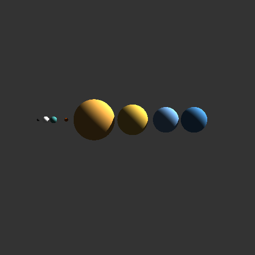
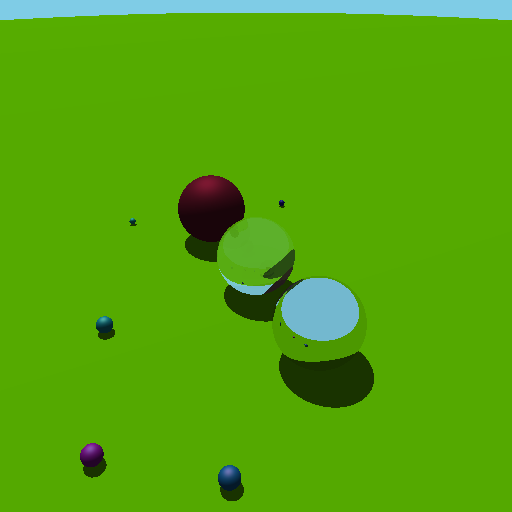

# Ray Tracing Project

## Electives

### Performance via parallelization

#### Sample output
```bash
Scene: frames/moving_camera_27.json...
Scene: frames/moving_camera_29.json...
Scene: frames/moving_camera_32.json...
Scene: frames/moving_camera_06.json...
animations/moving_camera_27.ppm done!
animations/moving_camera_29.ppm done!
Scene: frames/moving_camera_13.json...
animations/moving_camera_32.ppm done!
Scene: frames/moving_camera_10.json...
animations/moving_camera_06.ppm done!
Scene: frames/moving_camera_20.json...
Scene: frames/moving_camera_36.json...
animations/moving_camera_13.ppm done!
animations/moving_camera_20.ppm done!
Scene: frames/moving_camera_34.json...
Scene: frames/moving_camera_15.json...
animations/moving_camera_36.ppm done!
animations/moving_camera_10.ppm done!
Scene: frames/moving_camera_07.json...
Scene: frames/moving_camera_38.json...
animations/moving_camera_34.ppm done!
animations/moving_camera_07.ppm done!
Scene: frames/moving_camera_33.json...
animations/moving_camera_15.ppm done!
Scene: frames/moving_camera_02.json...
Scene: frames/moving_camera_35.json...
animations/moving_camera_38.ppm done!
Scene: frames/moving_camera_05.json...
animations/moving_camera_02.ppm done!
animations/moving_camera_33.ppm done!
Scene: frames/moving_camera_04.json...
Scene: frames/moving_camera_09.json...
animations/moving_camera_35.ppm done!
Scene: frames/moving_camera_24.json...
animations/moving_camera_05.ppm done!
Scene: frames/moving_camera_01.json...
animations/moving_camera_04.ppm done!
animations/moving_camera_09.ppm done!
Scene: frames/moving_camera_00.json...
Scene: frames/moving_camera_16.json...
animations/moving_camera_24.ppm done!
Scene: frames/moving_camera_28.json...
animations/moving_camera_01.ppm done!
Scene: frames/moving_camera_12.json...
animations/moving_camera_00.ppm done!
Scene: frames/moving_camera_18.json...
animations/moving_camera_16.ppm done!
Scene: frames/moving_camera_37.json...
animations/moving_camera_28.ppm done!
Scene: frames/moving_camera_08.json...
animations/moving_camera_12.ppm done!
Scene: frames/moving_camera_14.json...
animations/moving_camera_18.ppm done!
Scene: frames/moving_camera_21.json...
animations/moving_camera_37.ppm done!
Scene: frames/moving_camera_19.json...
animations/moving_camera_08.ppm done!
Scene: frames/moving_camera_26.json...
animations/moving_camera_14.ppm done!
Scene: frames/moving_camera_22.json...
animations/moving_camera_21.ppm done!
Scene: frames/moving_camera_03.json...
animations/moving_camera_19.ppm done!
Scene: frames/moving_camera_39.json...
animations/moving_camera_26.ppm done!
Scene: frames/moving_camera_25.json...
animations/moving_camera_22.ppm done!
Scene: frames/moving_camera_11.json...
animations/moving_camera_03.ppm done!
Scene: frames/moving_camera_23.json...
animations/moving_camera_39.ppm done!
Scene: frames/moving_camera_30.json...
animations/moving_camera_25.ppm done!
Scene: frames/moving_camera_31.json...
animations/moving_camera_11.ppm done!
Scene: frames/moving_camera_17.json...
animations/moving_camera_23.ppm done!
Done!

real	0m14.328s
user	0m40.394s
sys	0m7.020s
```




As shown, a directional light uniformly hits on all the spheres, creating an approximate scene for the planets in space lit by the sun light. Also notice that there is a shadow casted by planets that are close to each other.

### Refraction
Refraction is implemented using snell's law.

#### Artifact




As shown, The three big spheres have reflective, refractive, and diffusive properties respectively.

### Triangle
Triangle is implemented using Cramer's rule.

#### Artifact


As shown, a 3D Christmas tree is rendered using triangles.
